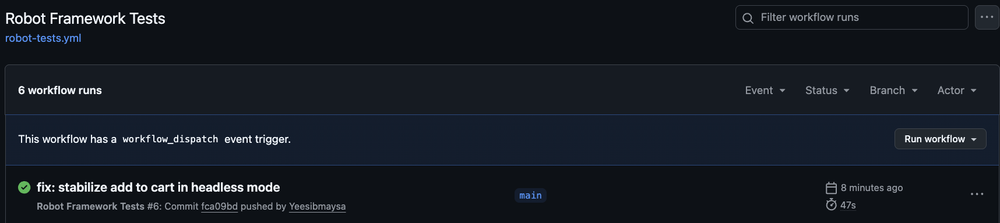
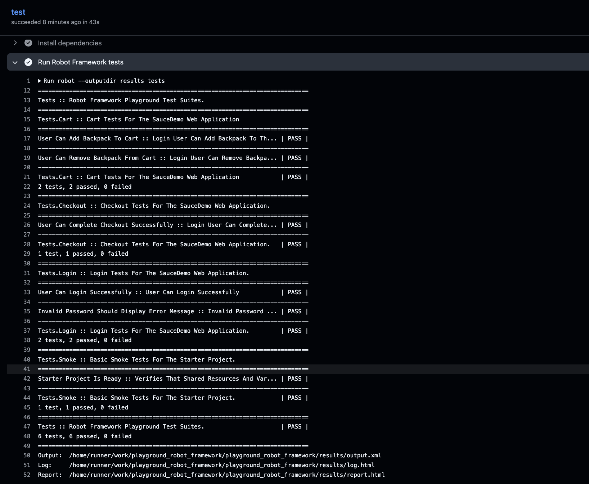

# SauceDemo Robot Framework Test Automation


A web test automation portfolio project for the SauceDemo application, built with Robot Framework and SeleniumLibrary.

## Project Overview

This project demonstrates end-to-end web testing using the Page Object Model. It covers login validation, shopping cart operations, and the complete checkout flow.

## Test Scenarios

- Successful login with valid credentials
- Login failure with invalid credentials
- Add Sauce Labs Backpack to the shopping cart
- Remove Sauce Labs Backpack from the shopping cart
- Complete the checkout process
- Verify that shared resources and variables are available

## Technology Stack

- Robot Framework
- SeleniumLibrary
- Python
- Google Chrome
- Git and GitHub
- GitHub Actions for Continuous Integration

## Key Features

- Page Object Model structure
- Reusable custom keywords
- Centralized test data and locators
- Headless browser execution
- Automatic test execution on GitHub Actions
- Robot Framework HTML reports and logs

## Requirements

- Python 3.10 or newer

## Setup

```bash
python3 -m venv .venv
source .venv/bin/activate
python -m pip install --upgrade pip
pip install -r requirements.txt
```

## Run Tests

Run all test suites:

```bash
robot --outputdir results tests
```

Run all tests in headless mode:

```bash
HEADLESS=true robot --outputdir results tests
```

Run an individual test suite:

```bash
robot --outputdir results tests/login.robot
robot --outputdir results tests/cart.robot
robot --outputdir results tests/checkout.robot
```

Run tests by tag:

```bash
robot --outputdir results --include login tests
robot --outputdir results --include cart tests
robot --outputdir results --include checkout tests
```

## Test Reports

Robot Framework generates the following files inside the `results/` directory:

- `report.html` — Test result summary
- `log.html` — Detailed execution log
- `output.xml` — Machine-readable test result

The `results/` directory is excluded from Git. GitHub Actions stores the reports as downloadable artifacts for 14 days.

## CI Test Evidence

### GitHub Actions Workflow

The automated test workflow completed successfully on GitHub Actions.



### Robot Framework Test Results

All 6 automated test cases passed in headless mode.




## Project Structure

```
playground_robot_framework/
├── .github/
│   └── workflows/
│       └── robot-tests.yml
├── resources/
│   ├── common.resource
│   └── pages/
│       ├── login_page.resource
│       ├── inventory_page.resource
│       ├── cart_page.resource
│       └── checkout_page.resource
├── tests/
│   ├── __init__.robot
│   ├── smoke.robot
│   ├── login.robot
│   ├── cart.robot
│   └── checkout.robot
├── variables/
│   ├── environments.py
│   └── saucedemo.py
├── .env.example
├── .gitignore
├── requirements.txt
└── README.md
```